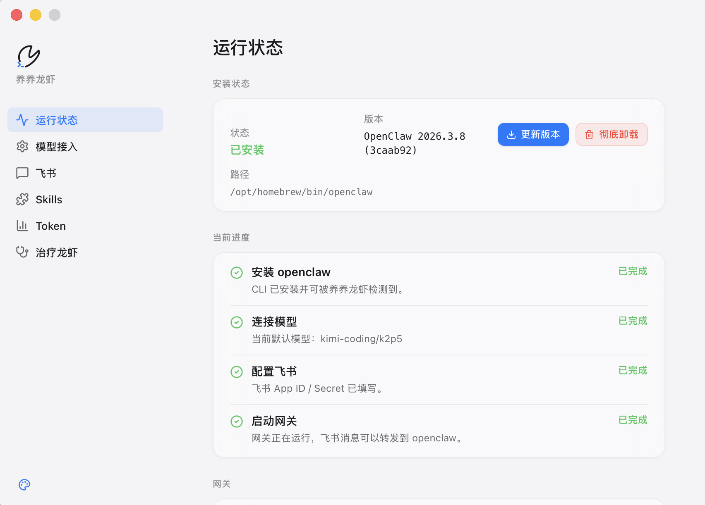

# FeedClaw Desktop

养养龙虾，面向 `OpenClaw` 的 macOS 桌面控制台。



## 它能做什么

- 一键安装、更新、彻底卸载 `openclaw`
- 接入模型：`API Key` 和 `OpenAI Codex OAuth`
- 配置飞书、测试连接、批准配对
- 启动 / 停止 / 修复 Gateway
- 安装、卸载、识别 Skills
- 查看 Token 趋势、模型明细、最近调用
- 做常见问题检查和修复

## 当前页面

- `运行状态`
- `模型接入`
- `飞书`
- `Skills`
- `Token`
- `治疗龙虾`

## 安装方式

### 方式一：直接下载 app

当前推荐对外分发的是：

- `养养龙虾.app.zip`

下载后解压，把 `养养龙虾.app` 拖到 `应用程序` 即可。

如果 macOS 首次打开拦截，可以执行：

```bash
xattr -dr com.apple.quarantine /Applications/养养龙虾.app
```

### 方式二：一条命令安装

仓库根目录提供了 `install.sh`，会自动：

- 解压 `.app.zip`
- 安装到 `/Applications`
- 去掉 quarantine
- 打开 app

本地测试命令：

```bash
./install.sh src-tauri/target/release/bundle/macos/养养龙虾.app.zip
```

如果后续把 `install.sh` 和 `zip` 放到 GitHub Releases，就可以变成：

```bash
curl -fsSL <install.sh 的 URL> | bash -s -- <app.zip 的 URL>
```

## 适用对象

适合这几类用户：

- 想用 `OpenClaw`，但不想先记一堆命令
- 想在 GUI 里完成 API、飞书、Gateway、Skills 管理
- 想把常用运维动作收进一个桌面面板

## 当前边界

- 真正聊天入口仍然在飞书
- 未加入 Apple Developer Program 前，分发包仍属于未签名测试版

## 开发

```bash
npm install
npm run tauri dev
```

构建正式包：

```bash
npm run tauri build
```

## 技术栈

- Tauri 2
- React 19
- TypeScript
- Rust

## 项目定位

一句话：

**FeedClaw Desktop = OpenClaw 的桌面控制台。**

### 外部运行时层

真正执行工作的是：

- 本机 `openclaw` CLI
- `~/.openclaw/openclaw.json`
- `~/.openclaw/agents/*`
- Gateway 进程
- LaunchAgent
- Feishu / skills / logs / sessions

## 目录结构

```text
src/
├── App.tsx
├── components/
│   ├── Sidebar.tsx
│   └── TerminalOverlay.tsx
├── lib/
│   └── tauri.ts
└── pages/
    ├── StatusPage.tsx
    ├── DiagnosisPage.tsx
    ├── ConfigPage.tsx
    ├── FeishuPage.tsx
    ├── SkillsPage.tsx
    └── TokenUsagePage.tsx

src-tauri/
├── src/
│   ├── lib.rs
│   ├── main.rs
│   └── commands/
│       ├── config.rs
│       ├── gateway.rs
│       ├── install.rs
│       ├── logs.rs
│       ├── runtime.rs
│       └── skills.rs
└── tauri.conf.json
```

## 开发命令

```bash
npm install
npm run tauri dev
```

## 校验命令

```bash
npm run build
cargo check --manifest-path src-tauri/Cargo.toml
```

## 运行时路径

当前项目实际会用到这些 `openclaw` 路径：

- `~/.openclaw/config.json`
- `~/.openclaw/openclaw.json`
- `~/.openclaw/agents/*/sessions/`
- `~/.openclaw/logs/`
- `~/.openclaw/workspace/`
- `/tmp/openclaw/`

## 当前已知边界

### 平台

- 当前主要面向 macOS
- Windows / Linux 没有作为当前发布目标

### 安装

- 一键安装依赖网络、Homebrew、Node/npm 环境
- 首次安装可能触发系统权限或 sudo

### 上游 CLI 不稳定项

养养龙虾已经做了一层兼容，但 `openclaw 2026.3.7` 仍有一些上游行为需要认识到：

- `doctor` 输出有时存在误报或文案矛盾
- `doctor --fix` 不是所有问题都能自动修
- 某些配置变更需要重启 Gateway 才生效
- `security audit` 会发现风险，但不一定提供自动 fix

## 审计快照

以 2026 年 3 月 9 日这轮本地审计为准，当前结果是：

- 功能校验通过：`npm run build`
- Rust 校验通过：`cargo check --manifest-path src-tauri/Cargo.toml`
- 上游 `openclaw doctor` 仍有假阳性
  - 会把 `loopback` 误报成 `0.0.0.0`
  - 会先报 `Gateway not running`，后面又报 `Runtime: running`
- 上游 `openclaw security audit --deep` 当前扫到 3 条重点告警
  - `channels.feishu.tools.doc` 仍允许创建文档并授予请求者权限
  - `plugins.allow` 还没显式锁定白名单
  - `gateway probe failed (deep)` 在当前机器上会报本地 `EPERM`，更像探测噪音，不一定等于网关不可用

这意味着当前版本已经能交付使用，但安全默认值还可以再收紧，尤其是：

- 不需要飞书文档工具时，直接关掉
- 给插件加显式 allowlist
- 把 `security audit --deep` 的结果继续翻译成更直接的页面修复动作

## 明确待做

- 完成左上角品牌 SVG / logo，替换当前临时图标
- 做 `彻底卸载` 功能
- 把 `plugins.allow` 和飞书文档工具权限继续收紧成页面可操作项
- 继续细化 Token 体检的上下文归因

### Token 优化不是万能省费器

当前 Token 体检已经能动态发现一部分高频浪费项，但它仍不是完整的“全自动成本优化器”。

它现在更像：

- 一个基于官方文档和本机日志的动态检查器
- 一个对高频问题给出可执行治疗动作的工具

## 推荐理解方式

如果只用一句话理解这个项目：

养养龙虾 = `openclaw` 的中文图形化控制台。

它负责：

- 安装
- 配置
- 接飞书
- 控网关
- 管技能
- 看 Token
- 做常见修复

真正的 Agent Runtime 和真正的对话执行，还是 `openclaw` 本身。
